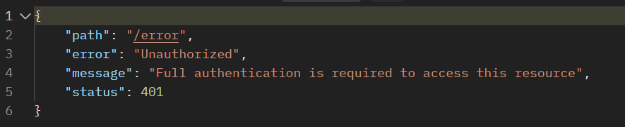

---

# Client Manager Application

Welcome to the Client Manager Application! This application provides a set of APIs to manage clients, authentication, and client details.

## Features

- **Admin Operations**: Perform CRUD operations on clients as an administrator.
- **Authentication**: Handle user authentication, including login, registration, and token refreshing.
- **Client Details Management**: Retrieve and update client details.

## Installation

To install and run the Client Manager Application locally, follow these steps:

1. Clone the repository to your local machine:

   ```bash
   git clone <repository_url>
   ```

2. Navigate to the project directory:

   ```bash
   cd client-manager-application
   ```

3. Build the application using Gradle:

   ```bash
   ./gradlew build
   ```

4. Run the application:

   ```bash
   ./gradlew bootRun
   ```

## Usage

### Admin Endpoints (`/admin`)

- **Add Client**:
    - Endpoint: `POST /admin/clients`
    - Description: Add a new client.
    - Authorization: Requires `ADMIN` role.
    - Request Body: `ClientRequest`
    - Response Body: `ClientResponse`

- **Get Client by ID**:
    - Endpoint: `GET /admin/clients/{id}`
    - Description: Retrieve a client by ID.
    - Authorization: Requires `ADMIN` role.
    - Path Variable: `id`
    - Response Body: `ClientResponse`

- **Get Clients**:
    - Endpoint: `GET /admin/clients`
    - Description: Retrieve a paginated list of clients.
    - Authorization: Requires `ADMIN` role.
    - Query Parameters: `page`, `size`
    - Response Body: `Page<FullClientResponse>`

- **Delete Client**:
    - Endpoint: `DELETE /admin/clients/{id}`
    - Description: Delete a client by ID.
    - Authorization: Requires `ADMIN` role.
    - Path Variable: `id`
    - Response Body: `{ "message": "Client with {id} has been deleted" }`

- **Search Clients**:
    - Endpoint: `GET /admin/search`
    - Description: Search for clients by name or other criteria.
    - Authorization: Requires `ADMIN` role.
    - Query Parameter: `search`
    - Response Body: `List<ClientResponse>`

### Authentication Endpoints (`/auth`)

- **Login**:
    - Endpoint: `POST /auth/login`
    - Description: Authenticate a user and generate an access token.
    - Request Body: `LoginRequest`
    - Response Body: `LoginResponse`

- **Register**:
    - Endpoint: `POST /auth/register`
    - Description: Register a new client.
    - Request Body: `ClientRequest`
    - Response Body: `ClientResponse`

- **Refresh Token**:
    - Endpoint: `POST /auth/refresh-token`
    - Description: Refresh the access token.
    - Request Body: `RefreshTokenRequest`
    - Response Body: `TokenResponse`

### Client Endpoints (`/client`)

- **Get Client Details**:
    - Endpoint: `GET /client/details`
    - Description: Retrieve details of the authenticated client.
    - Response Body: `ClientResponse`

- **Update Client Details**:
    - Endpoint: `PATCH /client/update`
    - Description: Update details of the authenticated client.
    - Request Body: `ClientUpdateRequest`
    - Response Body: `ClientResponse`

## License

This project is licensed under the MIT License. See the [LICENSE](LICENSE) file for details.


---

# Responses

### Trying to access with wrong JWT or accessing the methods without Role access



### Trying to search client that not exist


### Deleting the client


### Invalid Email


### Register


### Trying to register with same email


### Validation error with message


### Getting all clients with admin access


# Postman import: 

### Swagger exist but if you're Postman enjoyer ;) then go ahead import the json!
[Download JSON Data](assets/ClientManager.postman_collection.json)


